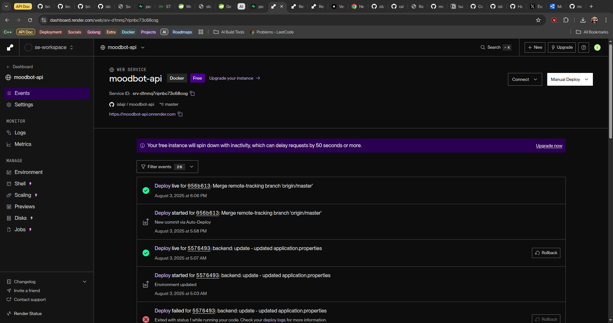

# Moodbot API

This is a REST API for an AI-powered chatbot that provides mental health and emotional support.

The detailed documenation available at: <https://documenter.getpostman.com/view/34198518/2sB3BANCqp>

## Included Features

The features included within the current release of the API include:

- User Creation and Authentication
- AI-powered chatting feature
- Daily mood tracking
- Optimized responses for emotional support

## Entity Relationship Diagram

This is the attached ER Diagram for the current release. PDF Version is available [here](<./shared-docs/MoodBot API ER Diagram.pdf>)

## Project Screenshot

This is a screenshot of the project, live on render at <https://moodbot-api.onrender.com>.

